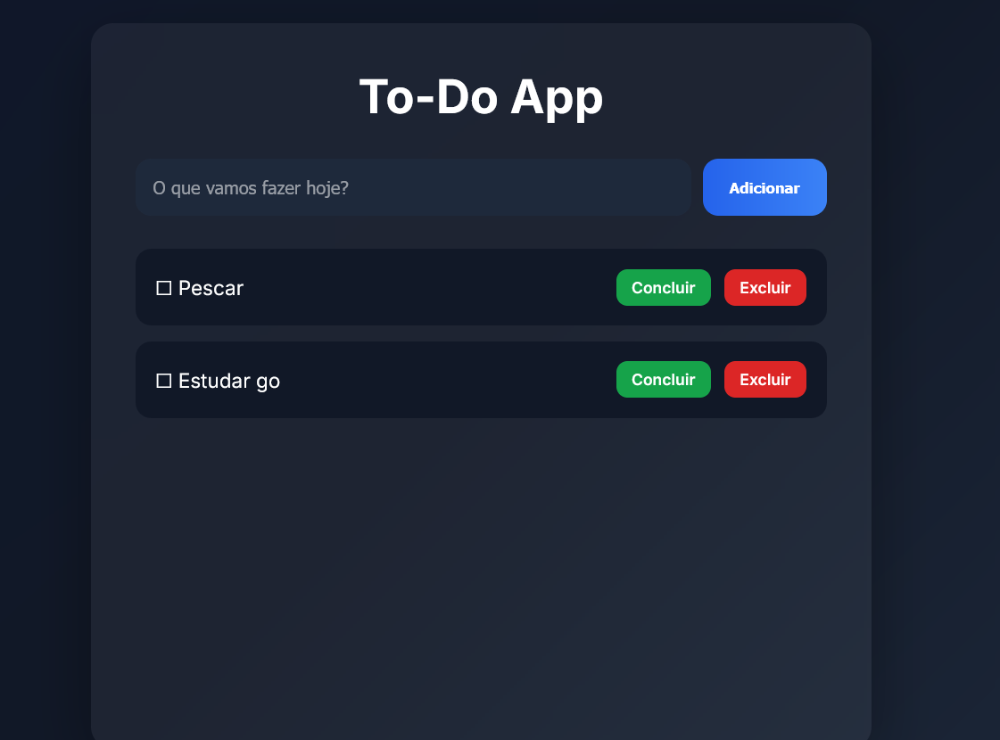

# To-Do App — Meu primeiro projeto web com Go

Uma aplicação web simples de lista de tarefas desenvolvida em **Go** durante meus estudos da linguagem.

O objetivo desse projeto foi aprender conceitos fundamentais de desenvolvimento web sem utilizar frameworks, construindo tudo passo a passo.

---

## Preview



---

## Funcionalidades

✔ Adicionar tarefas  
✔ Marcar tarefas como concluídas  
✔ Excluir tarefas  
✔ Interface web com HTML + CSS  
✔ Atualização sem duplicação de formulário (POST → Redirect → GET)

---

## Tecnologias utilizadas

- Go
- HTML
- CSS
- HTTP (`net/http`)
- Templates (`html/template`)
- Git
- GitHub
- WSL

---

## O que aprendi nesse projeto

Durante o desenvolvimento pratiquei:

- criação de servidores web em Go
- rotas HTTP
- templates HTML
- formulários
- manipulação de slices
- structs
- organização em funções
- CRUD básico
- integração entre frontend e backend
- versionamento com Git

---

## Como executar

Clone o repositório:

```bash
git clone git@github.com:Hayversong/todo-app-go.git
```

Entre na pasta:

```bash
cd todo-app-go
```

Execute:

```bash
go run .
```

Abra:

```text
http://localhost:8080
```

---

## Objetivo

Esse projeto não busca ser um sistema completo.

Ele foi desenvolvido como parte do meu processo de aprendizado em Go, explorando conceitos de backend e aplicações web de forma prática.

Pretendo revisitar este projeto no futuro e comparar minha evolução.

---

## Observações

Foi um projeto feito para estudar e experimentar ideias.

Feedbacks e sugestões são sempre bem-vindos.

---

Feito por Hayversong 